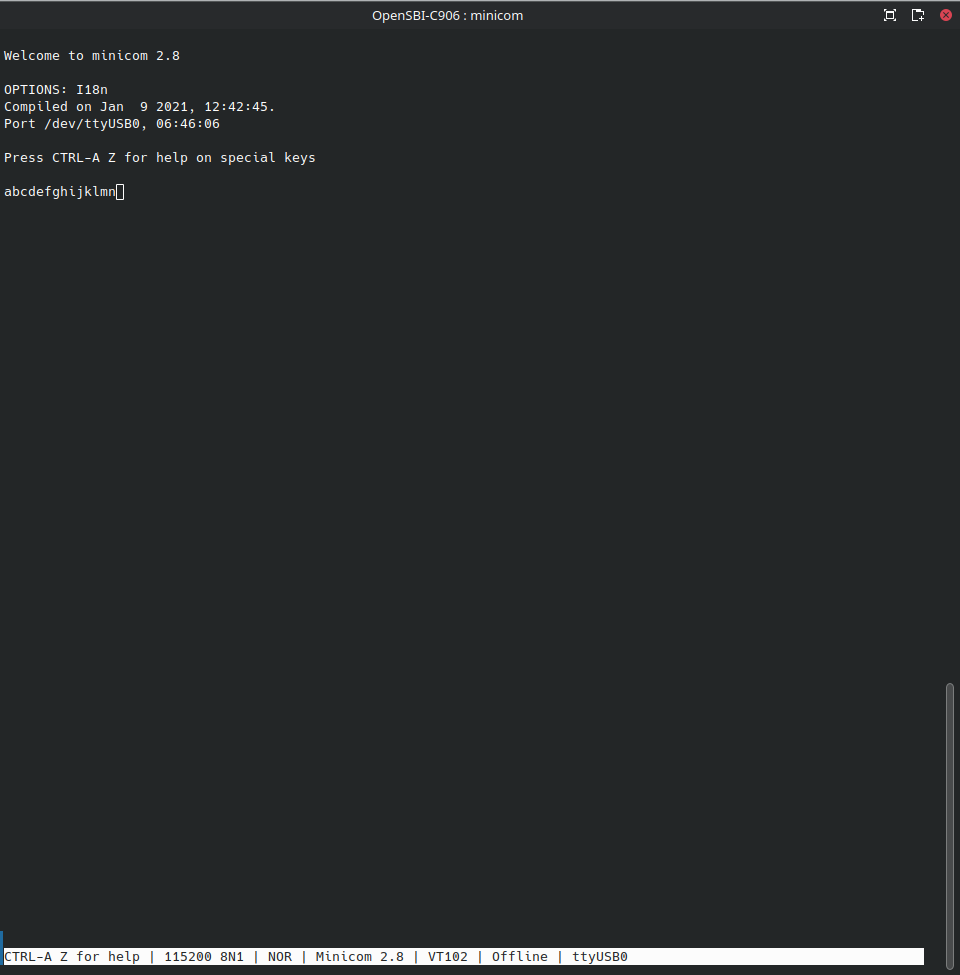

# 环境搭建 (Archlinux)

[TOC]

## 安装 riscv 工具链

```bash
$ sudo pacman -S riscv64-linux-gnu-gcc riscv64-linux-gnu-gdb
```

## 安装 minicom, 连接串口

minicom 是一个模拟终端软件, 可以用于连接串口.

```bash
$ sudo pacman -S minicom
```

我使用的是 USB 转 TTL UART 模块, 插入电脑后查看 USB 串口设备:

```bash
$ ls /dev/ttyUSB*
crw-rw---- 1 root uucp 188, 0 Apr  1 05:23 /dev/ttyUSB0
```

该设备属于 `uucp` 用户组, 用户组成员可以读写, 因此将自己的用户加入 `uucp` 用户组中, 否则打开串口时会出现 Permission Denied.

```bash
$ sudo usermod -aG uucp $USER
```

更改后需重启电脑生效 (或者打开一个 login shell 也可以). 重启后可以执行:

```bash
$ minicom -D /dev/ttyUSB0
Welcome to minicom 2.8

OPTIONS: I18n
Compiled on Jan  9 2021, 12:42:45.
Port /dev/ttyUSB0, 05:23:11

Press CTRL-A Z for help on special keys

```

成功打开串口终端.

安装后默认开启了硬件流控, 需要关闭: 进入 minicom 后, 按下 `Ctrl+A Z` 查看帮助菜单, 按下 `O` 进入 `cOnfigure Minicom`, 选择 `Serial port setup`, 按下 `F` 关闭 `Hard Flow Control`, 回车应用设置, 自动返回上一级菜单; 选择 `Save setup as dfl` 将当前设置保存为默认配置. 按 `Esc` 退出设置菜单, 将 USB to TTL 模块的 Tx 和 Rx 短接, 在 minicom 中输入字符可以看到回显, 说明配置正确.



## 安装 xfel

```bash
$ sudo pacman -S xfel libusb
```

测试 xfel 工具: 使用 USB-A to USB-C 线连接电脑和开发板, 注意要连接开发板上丝印为 OTG 的 USB-C 插座. 执行

```bash
$ xfel version
AWUSBFEX ID=0x00185900(D1/F133) dflag=0x44 dlength=0x08 scratchpad=0x00045000
```

成功输出 SoC 型号 `(D1/F133)`

使用上一节的方法打开串口终端, 并执行

```bash
$ xfel ddr d1
Initial ddr controller succeeded
```

同时 minicom 输出了
```
DRAM only have internal ZQ!!
get_pmu_exist() = 4294967295
ddr_efuse_type: 0x0
[AUTO DEBUG] two rank and full DQ!
ddr_efuse_type: 0x0
[AUTO DEBUG] rank 0 row = 16 
[AUTO DEBUG] rank 0 bank = 8 
[AUTO DEBUG] rank 0 page size = 2 KB 
[AUTO DEBUG] rank 1 row = 16 
[AUTO DEBUG] rank 1 bank = 8 
[AUTO DEBUG] rank 1 page size = 2 KB 
rank1 config same as rank0
DRAM BOOT DRIVE INFO: %s
DRAM CLK = 792 MHz
DRAM Type = 3 (2:DDR2,3:DDR3)
DRAMC ZQ value: 0x7b7bfb
DRAM ODT value: 0x42.
ddr_efuse_type: 0x0
DRAM SIZE =2048 M
DRAM simple test OK.
```

## 安装 T-HeadDebugServer

从 [平头哥社区](https://occ.t-head.cn/community/download) 下载 `T-Head-DebugServer-linux-x86_64-V5.16.7-20230109.sh.tar.gz`

```bash
$ tar -xzf ~/Downloads/T-Head-DebugServer-linux-x86_64-V5.16.7-20230109.sh.tar.gz
$ ls
T-Head-DebugServer-linux-x86_64-V5.16.7-20230109.sh
$ sudo mkdir -p /usr/local/share/T-Head-DebugServer
$ sudo ./T-Head-DebugServer-linux-x86_64-V5.16.7-20230109.sh
```

安装过程中提示输入安装路径, 输入 `/usr/local/share/T-Head-DebugServer` 即可. 安装脚本运行结束后, 创建 `/usr/local/bin/T-HeadDebugServer`:

```bash
#!/bin/bash

# 进入 T-Head-DebugServer 的安装目录, 否则会产生找不到 .so 的错误
pushd /usr/local/share/T-Head-DebugServer > /dev/null
./DebugServerConsole.elf "$@"
# 返回上一个目录
popd > /dev/null
```

添加 execute 权限:

```bash
$ sudo chmod +x /usr/local/bin/T-HeadDebugServer
```

尝试执行, 可以获得如下结果:

```bash
$ T-HeadDebugServer
+---                                                    ---+
|  T-Head Debugger Server (Build: Jan  9 2023, Linux)      |
   User   Layer Version : 5.16.07
   Target Layer version : 2.0
|  Copyright (C) 2022 T-HEAD Semiconductor Co.,Ltd.        |
+---                                                    ---+
ERROR: No T-HEAD CKLINK has been connected to PC or T-HEAD CKLINK driver isn't installed correctly!
ERROR: Cklink connection failed.
```

将调试器与开发板连接并上电, 并连接调试器和电脑, 再次启动 DebugServer:

```bash
$ T-HeadDebugServer
+---                                                    ---+
|  T-Head Debugger Server (Build: Jan  9 2023, Linux)      |
   User   Layer Version : 5.16.07
   Target Layer version : 2.0
|  Copyright (C) 2022 T-HEAD Semiconductor Co.,Ltd.        |
+---                                                    ---+
T-HEAD: CKLink_Lite_V2, App_ver 2.36, Bit_ver null, Clock 2526.316KHz,
       5-wire, With DDC, Cache Flush On, SN CKLink_Lite_V2-45C901C8D8.
+--  Debug Arch is CKHAD.  --+
+--  CPU 0  --+
T-HEAD Xuan Tie CPU Info:
        WORD[0]: 0x0910090d
        WORD[1]: 0x11002000
        WORD[2]: 0x260c0001
        WORD[3]: 0x30030066
        WORD[4]: 0x42180000
        WORD[5]: 0x50000000
        WORD[6]: 0x60000853
        MISA   : 0x8000000000b4112d
Target Chip Info:
        CPU Type is C906FDV, Endian=Little, Vlen=128, Version is R1S0P2.
        DCache size is 32K, 4-Way Set Associative, Line Size is 64Bytes, with no ECC.
        ICache size is 32K, 2-Way Set Associative, Line Size is 64Bytes, with no ECC.
        Target is 1 core.
        MMU has 256 JTLB items.
        PMP zone num is 8.
        HWBKPT number is 2, HWWP number is 2.
        MISA: (RV64IMAFDCVX, Imp M-mode, S-mode, U-mode)

GDB connection command for CPUs(CPU0):
        target remote 127.0.0.1:1025
        target remote 192.168.1.230:1025
        target remote 192.168.189.19:1025

****************  DebuggerServer Commands List **************
help/h
        Show help informations.
*************************************************************
DebuggerServer$ q
q
DebuggerServer$
DebuggerServer quit
```

DebugServer 已连接到调试器并读取开发板上的 CPU 型号.

## 下载 C906 编译器

从 [平头哥芯片开放社区](https://occ.t-head.cn/community/download?id=643604837828657152) 下载 GCC 编译器并解压到自定义目录.

```bash
$ tar -xzf Xuantie-900-gcc-elf-newlib-x86_64-V2.4.0-20220428.tar.gz -C /path/to/xuantie-gcc
```

## 编译 OpenSBI

注意, 必须使用平头哥提供的编译器才能够正常编译.

```bash
$ git clone git@github.com:Tina-Linux/OpenSBI-C906.git
Cloning into 'OpenSBI-C906'...
remote: Enumerating objects: 276, done.
remote: Counting objects: 100% (276/276), done.
remote: Compressing objects: 100% (230/230), done.
remote: Total 276 (delta 37), reused 265 (delta 32), pack-reused 0
Receiving objects: 100% (276/276), 281.45 KiB | 385.00 KiB/s, done.
Resolving deltas: 100% (37/37), done.
$ cd OpenSBI-C906
$ make CROSS_COMPILE=/path/to/xuantie-gcc/bin/riscv64-unknown-elf- PLATFORM=thead/c910 FW_JUMP_ADDR=0x80200000 FW_TEXT_START=0x80000000 PLATFORM_RISCV_ISA=rv64gcxthead -j16
...
OBJCOPY   platform/generic/firmware/fw_payload.bin
```

其中 `FW_JUMP_ADDR` 是 OpenSBI 初始化后, 跳转到下一阶段 bootloader 的地址; `FW_TEXT_START` 是 OpenSBI 执行时在内存中的起始地址, 根据自己的适配想法修改这两个值.

测试 OpenSBI:

```bash
$ xfel ddr d1
Initial ddr controller succeeded
$ xfel write 0x80000000 build/platform/thead/c910/firmware/fw_jump.bin
100% [================================================] 60.555 KB, 425.147 KB/s
$ xfel exec 0x80000000
```

minicom 输出了

```
OpenSBI v0.6
   ____                    _____ ____ _____
  / __ \                  / ____|  _ \_   _|
 | |  | |_ __   ___ _ __ | (___ | |_) || |
 | |  | | '_ \ / _ \ '_ \ \___ \|  _ < | |
 | |__| | |_) |  __/ | | |____) | |_) || |_
  \____/| .__/ \___|_| |_|_____/|____/_____|
        | |
        |_|

Platform Name          : Allwinner SUN20i - T-HEAD Xuantie Platform
Platform HART Features : RV64ACDFIMSUVX
Platform Max HARTs     : 1
Current Hart           : 0
Firmware Base          : 0x80000400
Firmware Size          : 75 KB
Runtime SBI Version    : 0.2

MIDELEG : 0x0000000000000222
MEDELEG : 0x000000000000b1ff
PMP0    : 0x0000000080000000-0x000000008001ffff (A)
PMP1    : 0x0000000040000000-0x000000007fffffff (A,R,W,X)
PMP2    : 0x0000000080000000-0x00000000bfffffff (A,R,W,X)
PMP3    : 0x0000000000020000-0x0000000000027fff (A,R,W,X)
PMP4    : 0x0000000000000000-0x000000003fffffff (A,R,W)
```